# Dine Roulette

## Overview

Unable to decide on your next meal? or just looking for the next spot in a pub crawl
</br>

</br>
Dine Roulette will pick you a spot to go next, and give you directions on how to go there
</br>
Click on Dine Roulette to test it out

Dine Roulette was developed using this [brief](Brief.md) for the technical requirements
with the tech up to me to decide on and implement

You can use the following account to find places near
</br>
Flinders Station, Melbourne, VIC or
</br>
Darling Harbour, Sydney, NSW
</br>
or create your own account and find Restaurants at places you're curious of

```
username: test34
password: 123123
```

## Built on and uses the following:

- Python
- JavaScript
- ReactJS
- NodeJS
- Flask
- PostgreSQL
- Heroku
- Google MUI

## Why the above?

Having used the MERN Stack for a while, I wanted to challenge myself and try other tech
So having learnt Flask and Python being my first language,
</br>
I decided to use Python in the backend and continue to use react in the frontend, as the responsiveness of react is hard to pass up.
For the database I used postgreSQL,
</br>
to have more expreience with it, as I saw it was the preferred backend for AWS.

## Installation Required

Dependency files included
</br>
For python [Requirements](./requirements.txt)
</br>
$ pip3 install -r requirements.txt

For JavaScript [Requirements](./client/package.json)
</br>
$ npm install

## Planning and Approach

Planning and Tech research was what was tackled first, including the user stories for Dine Roulette.
</br>
References will be made to the below sections, to how this app was planned

First was the user stories, how a person might stumble upon Dine Roulette and decide to use it, how and why is how the Figma concept was mapped out and how and what data might be need to be stored by the user.

This then lead to finding apis that can provide the information required to manipulate
into what i needed in the front end.

First was the places data, having used google api in a previous project,
</br>
one of the alternatives I found was Geoapify.
Geoapify uses opensource maps, it had multiple category search and its free tier was generous.
</br>
Originally planned to used the places data from GeoApify and that was how the ERD structure came to be,
however geoapify returns businesses that are no longer operational, this was discovered
few days in and I had to rewrite and hook it up to google in the end, the geocoding and mapping still uses open source maps.
</br>
postman was used to test the api calls, as each route was created.
This component by component development was who the project was developed.

### User Stories

As someone who has decision paralysis, help me find a place to eat, instead of spending more time looking for a place.

My group of friends are just saying okay to everything, and can't decide on a place to go together,
</br>
please decide, instead of making us choose sides

I'm really craving something right now, find me the closest place thats open, so I can satisfy these munchies

Just had a hard days work, and I'm craving a pint, point me towards a pub, so I don't have to plan for this

### Wireframe

Initial concept and and how the app could flow and interactive was done on Figma,
</br>
this did revealed the amount paths this app would require and the amount of potential calls would be needed to the backend
</br>
[Share](https://www.figma.com/file/bUONj8siujR7CFDPURElbo/Dine-Roulette?node-id=0%3A1)
</br>

### Wireframe Screenshots

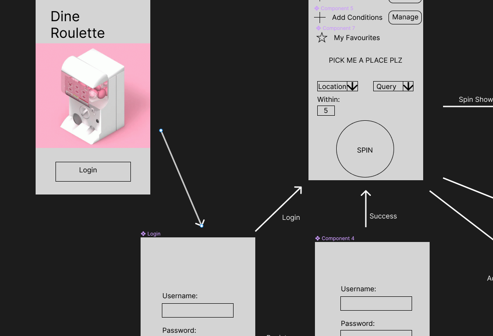
</br>
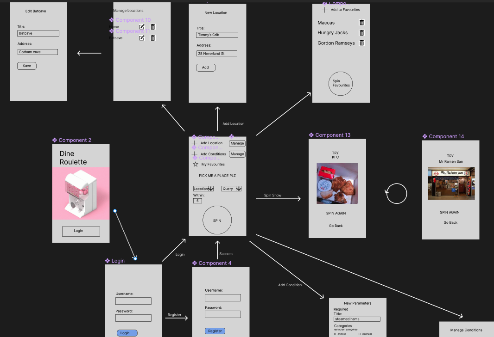

### ERD and Data Structure planning

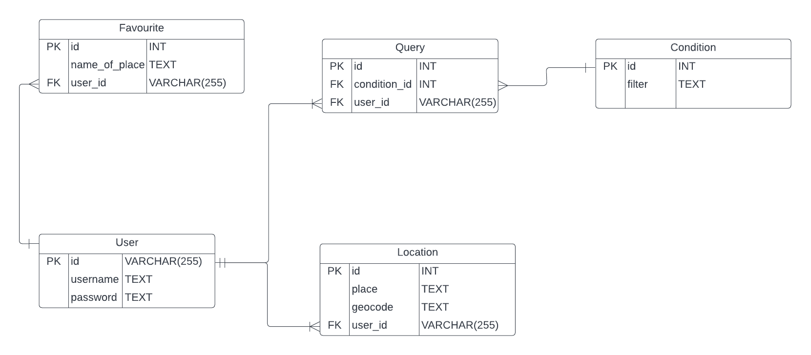

## Screenshots

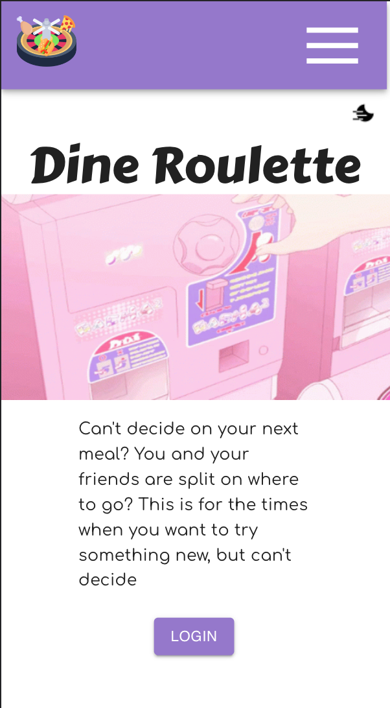
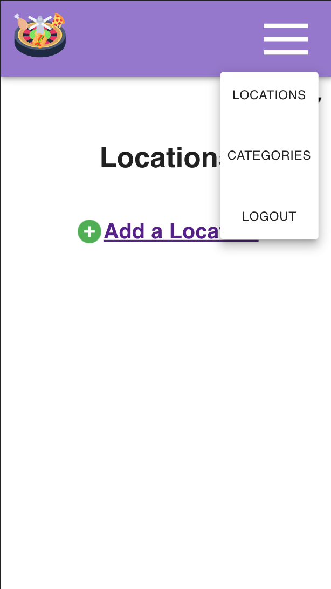
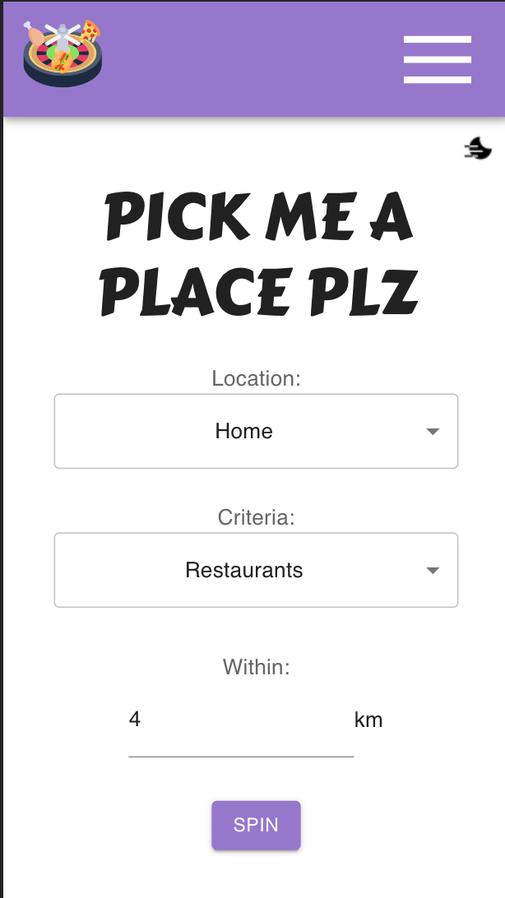
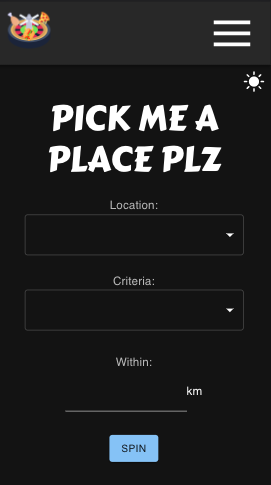
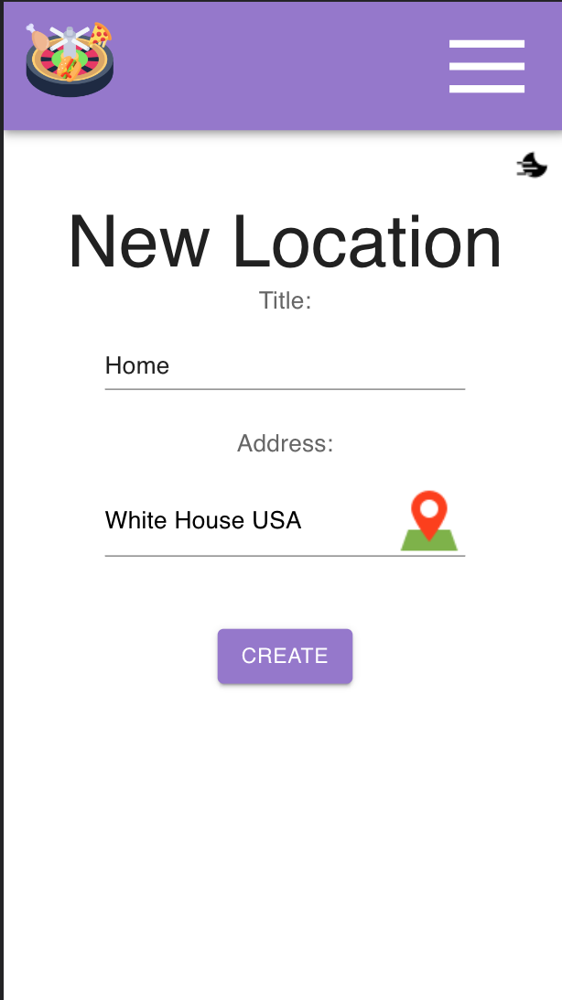
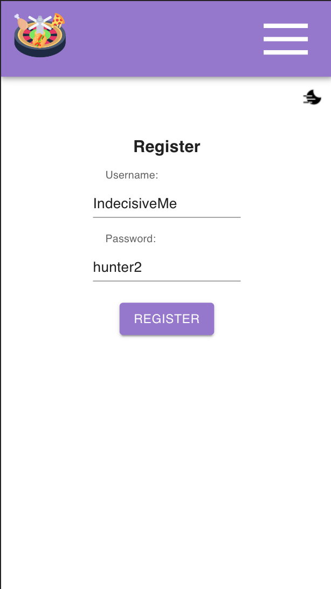
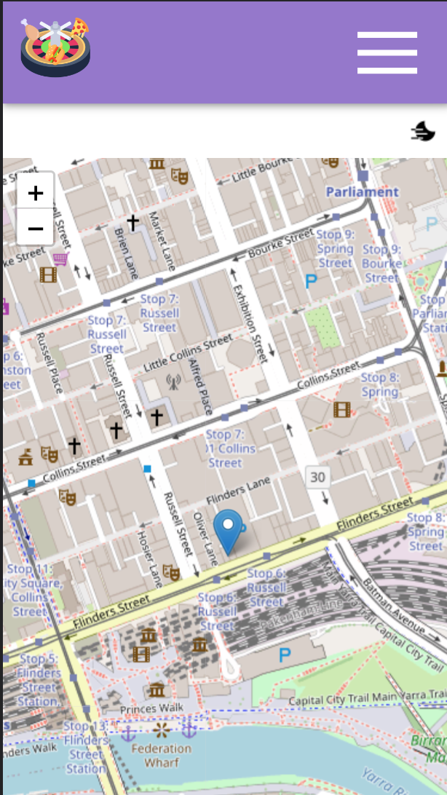
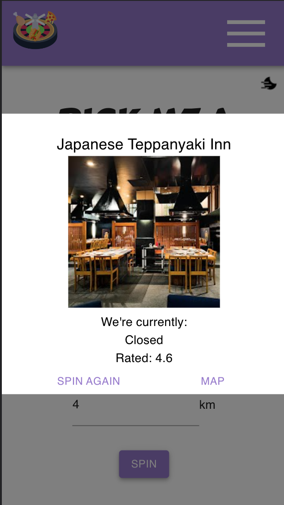
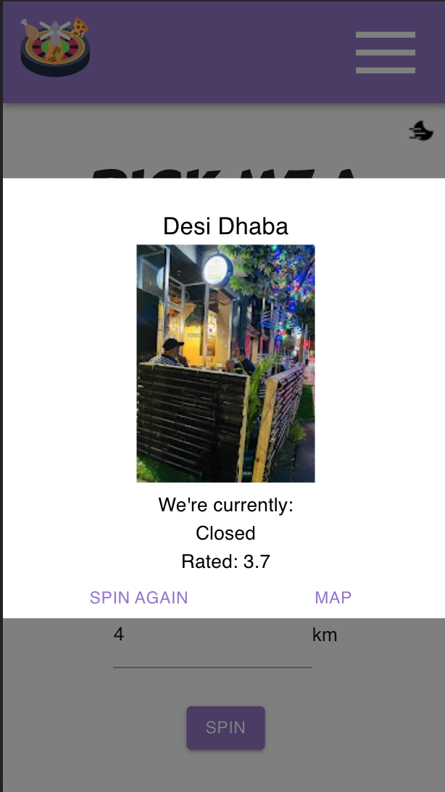
</br>
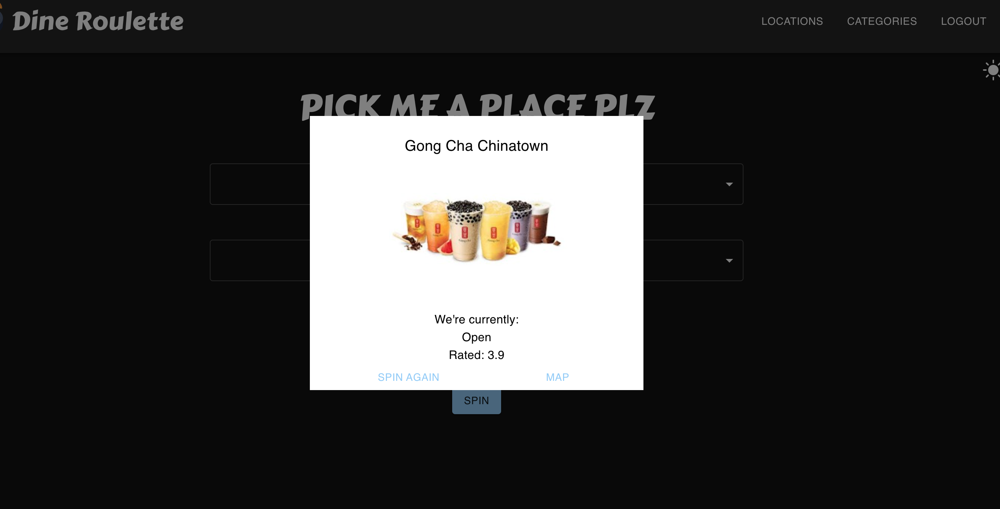

### Unresolved problems & Future Updates

Originally planned to have reviews, however Zomato API is no longer supported or works
Learnt how to use Python Scrappy to get the reviews, but have not hooked up the data yet

Also had planned to have the user store places in a favourites tab, so that they could query later,
or generate a random return from favourites

Current Location on home page isn't hooked up will need refactor my code from new locations
